# 1 实验背景

本实验是中国科学技术大学软件学院《软件体系结构》的大作业，因为时间比较匆忙，从定下需求到写好前后端代码大概只有5天左右，还要实现前后端的分离，所以也存在一些问题，比如各类通信还没有统一化。后期会慢慢修正。应付验收足够了。

## 1.1 实验名称

分布式集群监管系统

## 1.2 实验背景

分布式系统是一种由多个计算机组成的计算系统，能够协调工作，共同完成一个大的任务。它的主要特点是将一个大的任务分解为若干个小的子任务，分别由不同的计算机单独完成，然后将它们的结果组合在一起，实现整个任务的完成。分布式系统的优点在于能够提高计算效率，并且能够更好地应对大规模数据处理和高并发访问的需求。

集群资源管理就是一个分布式系统非常普遍的应用场景。在目前的大数据时代，各个公司的资源、任务相比过去都有了指数级增长，靠运维人员手工来监控、管理这些资源已然是不可能。而资源监管系统就能够自动监控和管理计算机系统中的各种资源，包括计算机的硬件设备和软件应用程序。资源监管系统可以帮助用户更好地管理和分配计算机系统中的各种资源，并且可以警告用户在计算机系统中出现的各种异常情况。

## 1.3 实验目的

1.实现一个具有心跳协议的分布式集群监管系统。

2.在实践中加深对软件体系结构的理解。

3.通过该实验加强实际开发的能力，培养团队协作能力。

## 1.4 功能简介

1.PC端实现用户登录功能，可以实时监控各设备节点的各种资源的使用状态，如CPU、内存、磁盘等；PC端还实现了配置设备、接收节点状态变更推送等功能。

2.分布式机器端可以接收服务器端命令，在机器状态发生异常时可以向服务器端发送异常信号；在资源使用状态发生变化时也可以向服务器端发送设备状态变化命令。

3.服务器端和客户端之间具有心跳协议，用于检测对方设备连接是否正常，让双方都可以及时地了解对方的状态，并在发生问题时采取相应的措施来保证通信的正常进行。

#  2  相关理论与技术基础

## 2.1 Springboot

Spring Boot是由Pivotal团队提供的全新框架，其设计目的是用来简化新Spring应用的初始搭建以及开发过程。该框架使用了特定的方式来进行配置，从而使开发人员不再需要定义样板化的配置。SpringBoot基于Spring4.0设计，不仅继承了Spring框架原有的优秀特性，而且还通过简化配置来进一步简化了Spring应用的整个搭建和开发过程。另外SpringBoot通过集成大量的框架使得依赖包的版本冲突，以及引用的不稳定性等问题得到了很好的解决。

SpringBoot所具备的特征有：

（1）可以创建独立的Spring应用程序，并且基于其Maven或Gradle插件，可以创建可执行的JARs和WARs；

（2）内嵌Tomcat或Jetty等Servlet容器；

（3）提供自动配置的“starter”项目对象模型（POMS）以简化Maven配置；

（4）尽可能自动配置Spring容器；

（5）提供准备好的特性，如指标、健康检查和外部化配置；

（6）绝对没有代码生成，不需要XML配置。

## 2.2 Vue

vue 框架是基于MVVM设计模式的前端框架，其中的Vue对象是MVVM设计模式中的VM视图模型。Vue对象将页面中 要改变的元素和data中变量进行绑定，绑定后它会一直监听data中变量值的改变，当值发生改变时，会自动找到与其绑定的元素并且让元素跟着发生改变，改变元素的过程不需要人工干预，提高了开发效率，而且这个过程不需要像 JavaScript 那样频繁DOM操作去改变页面结构，只是监听一片区域，提高了执行效率。

## 2.3 Sigar

Sigar（System Information Gatherer And Reporter），是一个开源的工具，提供了跨平台的系统信息收集的API，由C语言实现的。可以收集的信息包括：

·CPU信息：包括基本信息（vendor、model、mhz、cacheSize）和统计信息（user、sys、idle、nice、wait）

·文件系统信息：包括Filesystem、Size、Used、Avail、Use%、Type

·事件信息：类似Service Control Manager

·内存信息：物理内存和交换内存的总数、使用数、剩余数；RAM的大小

·网络信息：包括网络接口信息和网络路由信息

·进程信息：包括每个进程的内存、CPU占用数、状态、参数、句柄

·IO信息：包括IO的状态，读写大小等

·服务状态信息

·系统信息：包括操作系统版本，系统资源限制情况，系统运行时间以及负载，JAVA的版本信息等

## 2.4 Netty

Netty 是一个基于 JAVA NIO 类库的异步通信框架，它的架构特点是：异步非阻塞、基于事件驱动、高性能、高可靠性和高可定制性。

Netty是基于Java NIO client-server的网络应用框架，使用Netty可以快速开发网络应用，例如服务器和客户端协议。Netty提供了一种新的方式来开发网络应用程序，这种新的方式使它很容易使用和具有很强的扩展性。Netty的内部实现是很复杂的，但是Netty提供了简单易用的API从网络处理代码中解耦业务逻辑。Netty是完全基于NIO实现的，所以整个Netty都是异步的。Netty的应用场景非常广泛，分布式开源框架中Dubbo、Zookeeper，RocketMQ底层rpc通讯使用就是netty。

 

#  3  系统分析

## 3.1 功能性需求

 

  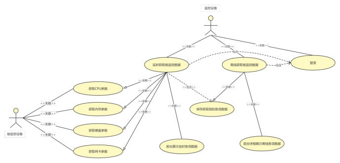

系统用例图


 

| ID         | Monitor01                                                    |
| ---------- | ------------------------------------------------------------ |
| 用例名称   | 登录账户                                                     |
| 父用例ID   | 无                                                           |
| 主要执行者 | 监控设备                                                     |
| 前置条件   | 注册账号成功                                                 |
| 事件流     | a.点击登录按钮，在账号输入框中输入用户名b.在密码输入框中输入密码c.点击登录按钮确认登录 |
| 可选事件流 | 无                                                           |
| 异常事件流 | a.登录失败，提示账号不存在b.返回到注册界面，注册账号后重新登录 |
| 后置条件   | 无                                                           |

 

| ID         | Monitor02                                                    |
| ---------- | ------------------------------------------------------------ |
| 用例名称   | 实时获取监控数据                                             |
| 父用例ID   | 无                                                           |
| 主要执行者 | 监控设备                                                     |
| 前置条件   | 无                                                           |
| 事件流     | a.在左侧导航栏点击被监控的客户机ipb.选择要查看的计算机组件（网卡、内存、CPU占用率等） |
| 可选事件流 | 无                                                           |
| 异常事件流 | 提示错误信息                                                 |
| 后置条件   | 保存获取到的各项数据                                         |

 

| ID         | Monitor03                                                    |
| ---------- | ------------------------------------------------------------ |
| 用例名称   | 离线获取监控数据                                             |
| 父用例ID   | 无                                                           |
| 主要执行者 | 监控设备                                                     |
| 前置条件   | 无                                                           |
| 事件流     | a.在左侧导航栏点击被监控的客户机ipb.选择要查看的计算机组件（网卡、内存、CPU占用率等） |
| 可选事件流 | 无                                                           |
| 异常事件流 | 提示错误信息                                                 |
| 后置条件   | 无                                                           |

 

| ID         | Monitor04                                                    |
| ---------- | ------------------------------------------------------------ |
| 用例名称   | 保存获取到的各项数据                                         |
| 父用例ID   | 无                                                           |
| 主要执行者 | 监控设备                                                     |
| 前置条件   | 服务器正常连接到客户机                                       |
| 事件流     | a.获取被监控的客户机的各项数据b.将获取到的数据（网卡、内存、CPU占用率等）保存到数据库中 |
| 可选事件流 | 无                                                           |
| 异常事件流 | 提示错误信息                                                 |
| 后置条件   | 无                                                           |

 

 

| ID         | Monitor05                                                    |
| ---------- | ------------------------------------------------------------ |
| 用例名称   | 前台详细展示离线各项数据                                     |
| 父用例ID   | 无                                                           |
| 主要执行者 | 监控设备                                                     |
| 前置条件   | 登录成功                                                     |
| 事件流     | a.点击左侧的导航栏，在导航栏中选择要查看的客户机b.点击待查看的客户机，显示该客户机的所有参数（网卡、内存、CPU占用率等） |
| 可选事件流 | 无                                                           |
| 异常事件流 | 提示错误信息                                                 |
| 后置条件   | 无                                                           |

 

 

| ID         | Monitor06                                                    |
| ---------- | ------------------------------------------------------------ |
| 用例名称   | 前台展示实时各项数据                                         |
| 父用例ID   | 无                                                           |
| 主要执行者 | 监控设备                                                     |
| 前置条件   | 登录成功                                                     |
| 事件流     | a.点击左侧的导航栏，在导航栏中选择要查看的客户机b.点击待查看的客户机，显示该客户机的所有参数（网卡、内存、CPU占用率等） |
| 可选事件流 | 无                                                           |
| 异常事件流 | 提示错误信息                                                 |
| 后置条件   | 无                                                           |

 

| ID         | Client01                                                     |
| ---------- | ------------------------------------------------------------ |
| 用例名称   | 获取CPU参数                                                  |
| 父用例ID   | 无                                                           |
| 主要执行者 | 被监控设备                                                   |
| 前置条件   | Sigar正确配置                                                |
| 事件流     | a.获取当前客户机的CPU相关数据b.将获取到的数据（CPU占用率、CPU核数、CPU的频率Hz、CPU当前空闲率、CPU当前错误率、CPU当前等待率等）保存到数据库中 |
| 可选事件流 | 无                                                           |
| 异常事件流 | 提示错误信息                                                 |
| 后置条件   | 无                                                           |

 

 

| ID         | Client02                                                     |
| ---------- | ------------------------------------------------------------ |
| 用例名称   | 获取内存参数                                                 |
| 父用例ID   | 无                                                           |
| 主要执行者 | 被监控设备                                                   |
| 前置条件   | Sigar正确配置                                                |
| 事件流     | a.获取当前客户机的内存相关数据b.将获取到的数据（内存总量、内存使用率、内存剩余率、交换区总量、当前交换区使用量、当前交换区剩余率等）保存到数据库中 |
| 可选事件流 | 无                                                           |
| 异常事件流 | 提示错误信息                                                 |
| 后置条件   | 无                                                           |

 

 

| ID         | Client03                                                     |
| ---------- | ------------------------------------------------------------ |
| 用例名称   | 获取硬盘参数                                                 |
| 父用例ID   | 无                                                           |
| 主要执行者 | 被监控设备                                                   |
| 前置条件   | Sigar正确配置                                                |
| 事件流     | a.获取当前客户机的硬盘相关数据b.将获取到的数据（硬盘总量、盘符名称、已经使用量、剩余大小、已经使用率等）保存到数据库中 |
| 可选事件流 | 无                                                           |
| 异常事件流 | 提示错误信息                                                 |
| 后置条件   | 无                                                           |

 

 

| ID         | Client04                                                     |
| ---------- | ------------------------------------------------------------ |
| 用例名称   | 获取网卡参数                                                 |
| 父用例ID   | 无                                                           |
| 主要执行者 | 被监控设备                                                   |
| 前置条件   | Sigar正确配置                                                |
| 事件流     | a.获取当前客户机的网卡相关数据b.将获取到的数据（网卡IP地址、子网掩码、网卡名称、网卡描述信息、网卡Mac地址、网关广播地址、发送的字节数等）保存到数据库中 |
| 可选事件流 | 无                                                           |
| 异常事件流 | 提示错误信息                                                 |
| 后置条件   | 无                                                           |

 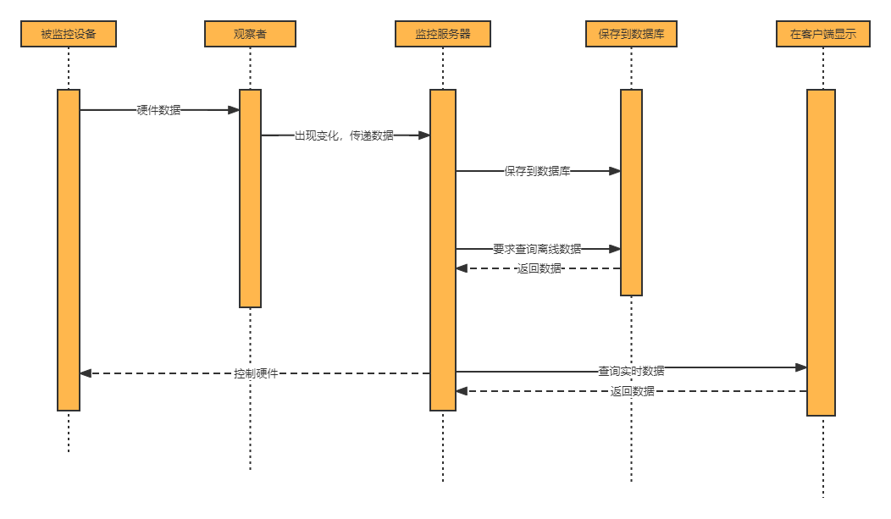

 

系统时序图

## 3.2 非功能性需求

| #    | 项目                   | 模块               | 级别                                                         | 技术参数                                                     |
| ---- | ---------------------- | ------------------ | ------------------------------------------------------------ | ------------------------------------------------------------ |
| 1    | 设计实现技术指标       | 系统架构           | A                                                            | 采用B/S模式架构。                                            |
| 2    | 面向对象开发语言与框架 | A                  | 采用Java作为开发语言，采用Spring框架。                       |                                                              |
| 3    | 注释和文档             | A                  | 符合CMMI软件开发过程标准文档（至少提供：需求、概要、详细设计、测试报告、部署和环境、用户手册），代码注释量>=10%。 |                                                              |
| 4    | 模块化和适合实训       | A                  | SOA设计、模块化，保证系统各模块单元较强的独立性适合实训教学。 |                                                              |
| 5    | 测试覆盖率             | A                  | 功能覆盖率>=100%，业务覆盖率>=100%，语言覆盖率>=100%，逻辑覆盖率>=80%。 |                                                              |
| 6    | 资源利用率要求         | CPU占用率          | B                                                            | <=75%利用率（附近标准配置）                                  |
| 7    | 内存使用率             | B                  | <=75%利用率（附近标准配置）                                  |                                                              |
| 8    | 响应时间要求           | 服务器             | B                                                            | <=100ms（附近标准配置）                                      |
| 9    | 网络                   | B                  | <=100ms（附近标准配置）                                      |                                                              |
| 10   | 客户端                 | B                  | <=5s（附近标准配置）                                         |                                                              |
| 11   | 系统稳定性要求         | 成熟性             | A                                                            | 真实的用户，成功使用本系统                                   |
| 12   | 稳定性                 | B                  | 无故障运行时间>=365天，系统恢复时间<=2小时。                 |                                                              |
| 13   | 典型意义               | A                  | 案例项目要有典型意义，有推广价值。                           |                                                              |
| 14   | Web服务接口要求        | WebService服务器端 | A                                                            | 支持协议定制，支持安全过滤，支持消息队列，多种模式重发，支持成功检测。消息延迟<=2S，丢包<=0.001%。 |
| 15   | WebService移动终端     | A                  | 支持协议定制，支持安全过滤，支持消息队列，多种模式重发，支持成功检测。消息延迟<=2S，丢包<=0.001%。 |                                                              |
| 16   | 集成部署环境           | 服务器             | A                                                            | Linux                                                        |
| 17   | 数据库                 | A                  | MySQL                                                        |                                                              |

说明：级别（A:表示非常重要必须达到的技术性能要求,B:表示重要推荐达到的技术性能要求,C：表示非重要可以弱化的技术性能要求.）

 

## 3.3 开发环境

| 项目         | 名称                   | 版本    |
| ------------ | ---------------------- | ------- |
| 开发平台     | Windows                | Win11   |
| 开发工具     | Intellij IDEA、VS Code | 2022.10 |
| 代码管理工具 | git                    | 2.35.1  |
| 开发环境     | Java                   | 1.8     |

## 3.4 客户机环境

（1）CPU：Pentium III以上处理器

（2）OS：Windows XP以上版本、Linux、Mac OS

（3）RAM：512MB以上内存

（4）Web：IE10以上版本，推荐使用Chrome、Firefox、Edge浏览器

#  4  系统设计

## 4.1 系统设计的基本原则

实用性：系统建设应当紧紧围绕着日常业务工作的需要，针对不同业务的特点，设计操作简便、结构合理、运转流畅、适应性强的分布式集群监控系统。

先进性：在系统的总体架构上，要采用国际上先进、成熟、可靠的技术。在系统中采用功能强大的Springboot作为后台的开发框架，采用先进的数据库管理系统，采用组件的开发模式，增强系统的可维护性和可扩展性。

开放性：为了满足与其它系统数据交换的需要，系统必须提供开放性的数据接口。

安全性：系统的安全性是系统建设中必须考虑的问题之一，采用多层加密技术，以保证数据的安全性, 对工作流程进行安全分级审查，对数据提供自动备份机制。

易用性：大部分业务人员不是专业的计算机人员，文化程度参差不齐，因此，操作界面的方便性将极大地影响到系统的顺利运行。

可扩展性：采用组件模块化设计，保证系统的可扩展性与高度兼容性。

## 4.2 系统的结构设计

系统结构设计如下图所示：

 

分布式集群监管系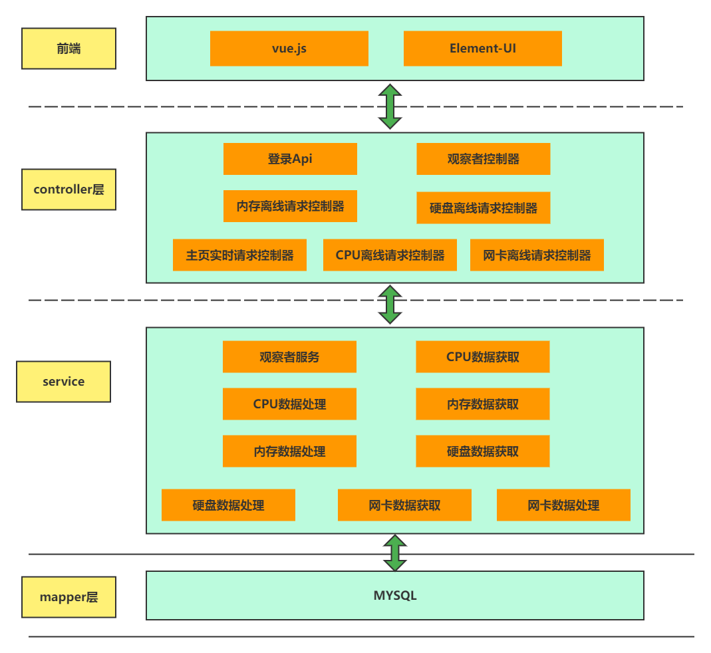统总体框架图

## 4.3 接口的设计

 根据分布式集群管理系统的需求，按照RESTFUL风格，设计系统接口。

### 4.3.1监控端接口

（1）获取客户机CPU信息

接口说明:获取客户机的CPU信息

接口地址:/server/cpu/hasCondition/{page}/{limit}/{time}/{ip}

请求方式：get

请求参数：

| 参数名称 | 说明             | ***\*in\**** | 是否必须 | 类型   |
| -------- | ---------------- | ------------ | -------- | ------ |
| page     | 当前页           | path         | true     | int    |
| limit    | 每页记录数       | path         | true     | int    |
| time     | 传入要查询的时间 | path         | true     | string |
| ip       | 传入ip           | path         | true     | string |

响应数据:

{
  code (integer, optional): 返回码 ,
  data (object, optional): 返回数据 ,
  message (string, optional): 返回消息 ,
  success (boolean, optional): 是否成功
}

响应参数说明:

| 参数名称 | 说明         | 类型    |
| -------- | ------------ | ------- |
| code     | 响应状态码   | integer |
| data     | 响应数据     | object  |
| message  | 响应状态描述 | string  |
| success  | 是否成功     | boolean |

响应状态码说明:

| 状态码 | 说明         |
| ------ | ------------ |
| 200    | OK           |
| 401    | Unauthorized |
| 403    | Forbidden    |
| 404    | Not Found    |

（2）获取客户机Disk信息

接口说明:获取客户机Disk信息

接口地址:/server/disk/hasCondition/{page}/{limit}/{time}/{ip}

请求方式：GET

请求参数：

| 参数名称 | 说明             | in   | 是否必须 | 类型   |
| -------- | ---------------- | ---- | -------- | ------ |
| page     | 当前页           | path | true     | int    |
| limit    | 每页记录数       | path | true     | int    |
| time     | 传入要查询的时间 | path | true     | string |
| ip       | 传入ip           | path | true     | string |

响应数据:

{
  code (integer, optional): 返回码 ,
  data (object, optional): 返回数据 ,
  message (string, optional): 返回消息 ,
  success (boolean, optional): 是否成功
}

响应参数说明:

| 参数名称 | 说明         | 类型    |
| -------- | ------------ | ------- |
| code     | 响应状态码   | integer |
| data     | 响应数据     | object  |
| message  | 响应状态描述 | string  |
| success  | 是否成功     | boolean |

响应状态码说明:

| 状态码 | 说明         |
| ------ | ------------ |
| 200    | OK           |
| 401    | Unauthorized |
| 403    | Forbidden    |
| 404    | Not Found    |

（3）获取客户机内存信息

接口说明:获取客户机内存信息

接口地址:/server/memory/hasCondition/{page}/{limit}/{time}/{ip}

请求方式：GET

请求参数：

| 参数名称 | 说明             | in   | 是否必须 | 类型   |
| -------- | ---------------- | ---- | -------- | ------ |
| page     | 当前页           | path | true     | int    |
| limit    | 每页记录数       | path | true     | int    |
| time     | 传入要查询的时间 | path | true     | string |
| ip       | 传入ip           | path | true     | string |

响应数据:

```json
{
  code (integer, optional): 返回码 ,
  data (object, optional): 返回数据 ,
  message (string, optional): 返回消息 ,
  success (boolean, optional): 是否成功
}
```


响应参数说明:

| 参数名称 | 说明         | 类型    |
| -------- | ------------ | ------- |
| code     | 响应状态码   | integer |
| data     | 响应数据     | object  |
| message  | 响应状态描述 | string  |
| success  | 是否成功     | boolean |

响应状态码说明:

| 状态码 | 说明         |
| ------ | ------------ |
| 200    | OK           |
| 401    | Unauthorized |
| 403    | Forbidden    |
| 404    | Not Found    |

（4）获取客户机网卡信息

接口说明:获取客户机网卡信息

接口地址:/server/net/hasCondition/{page}/{limit}/{time}/{ip}

请求方式：GET

请求参数：

| 参数名称 | 说明             | in   | 是否必须 | 类型   |
| -------- | ---------------- | ---- | -------- | ------ |
| page     | 当前页           | path | true     | int    |
| limit    | 每页记录数       | path | true     | int    |
| time     | 传入要查询的时间 | path | true     | string |
| ip       | 传入ip           | path | true     | string |

响应数据:

```json
{
  code (integer, optional): 返回码 ,
  data (object, optional): 返回数据 ,
  message (string, optional): 返回消息 ,
  success (boolean, optional): 是否成功
}
```


响应参数说明:

| 参数名称 | 说明         | 类型    |
| -------- | ------------ | ------- |
| code     | 响应状态码   | integer |
| data     | 响应数据     | object  |
| message  | 响应状态描述 | string  |
| success  | 是否成功     | boolean |

响应状态码说明:

| 状态码 | 说明         |
| ------ | ------------ |
| 200    | OK           |
| 401    | Unauthorized |
| 403    | Forbidden    |
| 404    | Not Found    |

### 4.3.2 客户机接口

（1）获取本机CPU信息

接口说明:获取本机CPU信息

接口地址:/rt/cpu/findinfo

请求方式：GET

请求参数：暂无

响应数据:

```json
[
  {
    "computerIp": "114.214.174.197",
     "cpuNo": 1,
     "cpuName": "第01块CPU信息",
     "cpuManufacturer": "Intel",
     "cpuTotalHz": 2688,
     "cpuType": "12th Gen Intel(R) Core(TM) i7-12700H",
     "cpuUserUserate": "0.0%",
     "cpuSysUserate": "0.0%",
     "cpuWaitrate": "0.0%",
     "cpuErrorrate": "0.0%",
     "cpuFreerate": "100.0%",
     "cpuTotalUserate": "0.0%",
     "gmtCreate": null
  }
]
```


响应参数说明:

| 参数名称        | 说明                        | 类型    |
| --------------- | --------------------------- | ------- |
| computerIp      | cpu所在电脑的ip             | string  |
| cpuNo           | cpu在多核处理器机器中的编号 | integer |
| cpuName         | cpu的名称                   | string  |
| cpuManufacturer | cpu的生产厂家               | string  |
| cpuTotalHz      | CPU的总量MHz                | integer |
| cpuType         | CPU类别                     | string  |
| cpuUserUserate  | CPU用户使用率               | string  |
| cpuSysUserate   | CPU系统使用率               | string  |
| cpuWaitrate     | CPU当前等待率               | string  |
| cpuErrorrate    | CPU当前错误率               | string  |
| cpuFreerate     | CPU当前空闲率               | string  |
| cpuTotalUserate | CPU总的使用率               | string  |
| gmtCreate       | 创建时间                    | Date    |

响应状态码说明:

| 状态码 | 说明         | chema |
| ------ | ------------ | ----- |
| 200    | OK           | Cpu   |
| 401    | Unauthorized |       |
| 403    | Forbidden    |       |
| 404    | Not Found    |       |

（2）获取本机Disk信息

接口说明:获取本机磁盘信息

接口地址:/rt/disk/findinfo

请求方式：GET

请求参数：暂无

响应数据:

```json
{
  {
    "computerIp": "114.214.174.197",
     "gmtCreate": null,
     "dfree": "101547100",
     "dcurrentWrite": "2439307",
     "dtype": "NTFS",
     "dtotal": "204800",
     "dname": "C:\\",
     "duse": "108169120",
     "dfreeRate": "48.42",
     "dcurrentRead": "2356237",
     "duseRate": "51.58"
  }
}
```


响应参数说明:

| 参数名称      | 说明            | 类型   |
| ------------- | --------------- | ------ |
| computerIp    | cpu所在电脑的ip | string |
| gmtCreate     | 响应数据        | date   |
| dfree         | 剩余大小        | string |
| dcurrentWrite | 写出            | string |
| dtype         | 盘符类型        | string |
| dtotal        | 硬盘总量        | string |
| dname         | 盘符名称        | string |
| duse          | 已经使用量      | string |
| dfreeRate     | 硬盘剩余率      | string |
| dcurrentRead  | 读入            | string |
| duseRate      | 已经使用率      | string |

响应状态码说明:

| 状态码 | 说明         | schema |
| ------ | ------------ | ------ |
| 200    | OK           | Disk   |
| 401    | Unauthorized |        |
| 403    | Forbidden    |        |
| 404    | Not Found    |        |

（3）获取本机内存信息

接口说明:获取本机内存信息

接口地址:/rt/memory/findinfo

请求方式：GET

请求参数：暂无

响应数据:

```json
{
   "computerIp": "114.214.174.197",
   "gmtCreate": null,
   "mswapUse": "21.06",
   "muserate": "94.70",
   "mfree": "0.83",
   "mswapFree": "3.46",
   "mfreerate": "5.30",
   "mswapTotal": "24.52",
   "mtotal": "15.73",
   "muse": "14.90",
   "mswapFreerate": "14.13",
   "mswapUserate": "85.87"
}
```


响应参数说明:

| 参数名称      | 说明             | 类型   |
| ------------- | ---------------- | ------ |
| computerIp    | cpu所在电脑的ip  | string |
| gmtCreate     | 创建时间         | date   |
| mswapUse      | 当前交换区使用量 | string |
| muserate      | 内存使用率       | string |
| mfree         | 当前内存剩余量   | string |
| mswapFree     | 当前交换区剩余量 | string |
| mfreerate     | 内存剩余率       | string |
| mswapTotal    | 交换区总量       | string |
| mtotal        | 内存总量         | string |
| muse          | 当前内存使用量   | string |
| mswapFreerate | 当前交换区剩余率 | string |
| mswapUserate  | 当前交换区使用率 | string |

响应状态码说明:

| 状态码 | 说明         | schema |
| ------ | ------------ | ------ |
| 200    | OK           | Memory |
| 401    | Unauthorized |        |
| 403    | Forbidden    |        |
| 404    | Not Found    |        |

（4）获取本机网卡信息

接口说明:获取本机网卡信息

接口地址:/rt/net/findinfo

请求方式：GET

请求参数：暂无

响应数据:

```json
[
   {
     "computerIp": "114.214.174.197",
     "gmtCreate": null,
     "nsendPackets": "0",
     "nmask": "0.0.0.0",
     "nacceptByte": "0",
     "nethName": "eth0",
     "nip": "0.0.0.0",
     "nethType": "Ethernet",
     "nsendByte": "0",
     "nmacAddress": "98:8F:E0:61:11:AB",
     "nacceptDropPackets": "0",
     "nacceptPackets": "0",
     "nsendDropPackets": "0",
     "nsendErrorPackets": "0",
     "nacceptErrorPackets": "0",
     "nethDescription": "Intel(R) Ethernet Connection (16) I219-V-WFP Native MAC Layer LightWeight Filter-0000",
     "nbroadcastAddress": "0.0.0.0"
   }
]
```


响应参数说明:

| 参数名称            | 说明                 | 类型   |
| ------------------- | -------------------- | ------ |
| computerIp          | cpu所在电脑的ip      | string |
| gmtCreate           | 创建时间             | date   |
| nsendPackets        | 发送的总包裹数       | string |
| nmask               | 子网掩码             | string |
| nacceptByte         | 接收到的总字节数     | string |
| nethName            | 网卡名字             | string |
| nip                 | 网卡IP地址           | string |
| nethType            | 网卡类型             | string |
| nsendByte           | 发送的总字节数       | string |
| nmacAddress         | 网卡MAC地址          | string |
| nacceptDropPackets  | 接收时丢弃的包数     | string |
| nacceptPackets      | 接收的总包裹数       | string |
| nsendDropPackets    | 发送时丢弃的包数     | string |
| nsendErrorPackets   | 发送数据包时的错误数 | string |
| nacceptErrorPackets | 接收到的错误包数     | string |
| nethDescription     | 网卡描述信息         | string |
| nbroadcastAddress   | 网关广播地址         | string |

响应状态码说明:

| 状态码 | 说明         | schema |
| ------ | ------------ | ------ |
| 200    | OK           | Net    |
| 401    | Unauthorized |        |
| 403    | Forbidden    |        |
| 404    | Not Found    |        |

 

## 4.4 设计模式


 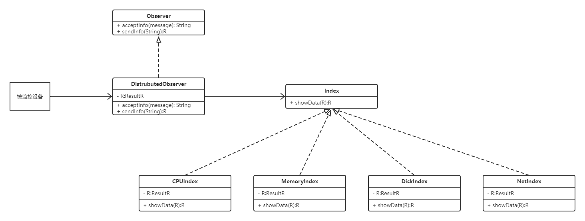


观察者模式

 

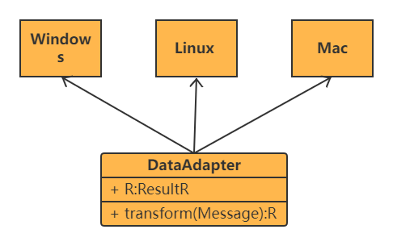

适配器模式


## 4.5 心跳协议设计

基于Netty提供的各种类和编解码器实现心跳协议的步骤如下：

1.定义一个心跳消息，并实现一个编码器和解码器，用于将心跳消息编码成字节数组，并从字节数组中解码出心跳消息。

2.在客户端和服务器端分别启动一个定时器，用于定期发送心跳消息。

3.在客户端和服务器端分别设置一个超时时间，用于检测对方是否还活着。如果在超时时间内没有收到对方的心跳消息，就认为对方已经掉线，并采取相应的措施。

4.在客户端和服务器端分别实现心跳处理器，用于接收心跳消息，并更新对方的状态。

 

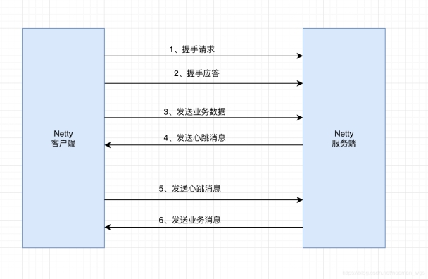 

基于Netty的心跳协议的工作流程

 

 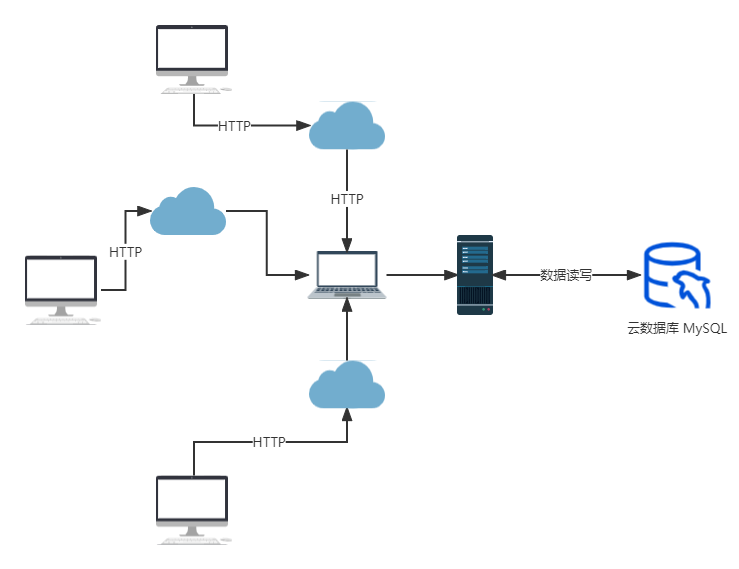

系统架构图

 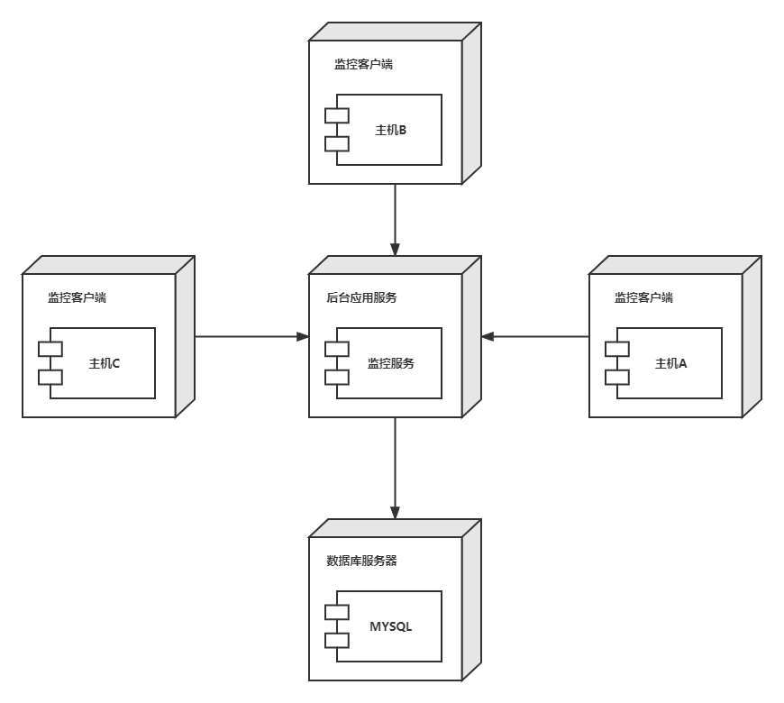

系统部署图

#  5  系统实现

整个分布式集群监控系统采用B/S模式，包括服务器端和浏览端。服务器端负责收集和管理各个客户机的资源数据（CPU、内存、网卡等），浏览端主要提供用户对各个客户机的资源使用情况进行查看。

 

用户登录界面

 

 

CPU实时数据界面

 

Cpu离线数据界面1

 

 

Cpu离线数据界面2

 

内存实时数据界面

 

 

内存离线数据界面

 

 

网卡实时数据界面

 

 

网卡离线数据界面1

 

 

网卡离线数据界面2

 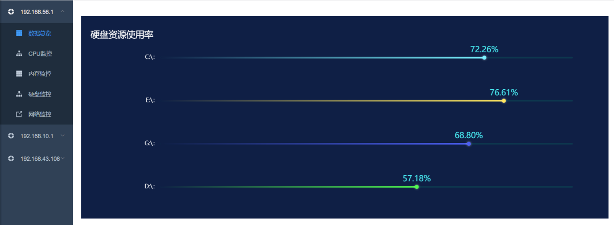

硬盘监控

#  6  系统亮点

## 6.1 Toke登录

我们使用Toke登录满足了非功能性需求的易用性、安全性、可测试性和经济性。

易用性：用户只需要填写自己想要的账号和密码，在账号不冲突的情况下就可以注册，如果账号的冲突或者不满足注册条件，会提示注册出现错误。登录的时候，如果账号和密码不正确，则会提示登录失败，重新登录；反之则进去系统。

安全性方面：我们使用Token 可以存放在前端任何地方，可以不用保存在 Cookie 中，提升了页面的安全性。Token 下发之后，只要在生效时间之内，就一直有效，如果服务器端想收回此 Token 的权限，并不容易。

经济性方面：服务器端不需要存放 Token，所以不会对服务器端造成压力，即使是服务器集群，也不需要增加维护成本。

可测试方面：通过正则表达式和操作的简便性，是的测试人员只需要设计简单的测试用例边界，即可验证，而不需要再编写测试代码。


Token登录


 

## 6.2 前端页面展示

我们的前端页面具有可用性高、易用性强、方便可维护性、满足可移植性、具有兼容性等非功能性需求。同时具有美观性、信息详实和实时性和终端用户可自定义性等特点。

在可用性方面：我们采用了Nacos注册中心、Feign远程调用、Ribbon 负载均衡、Feign远程调用等微服务技术，使系统具有了灾备、故障转移、集群、ping等基本功能，使得系统在可用性方面较为突出。

在易用性方面：我们设计了统一风格界面、个性化定制。用户登录网站后，需要选择那台服务器都可以选择查看，系统提供了实时查看和离线查看，都用可视化界面表示。如果用户关心某一项资源情况也可以在旁边栏选择查看，使用十分简单方便。

在可维护性方面：我们采用了稳定的模块划分（解耦）、设计模式、分层。首先我们做了基本的模块划分，client部署在被监控机器上，server部署在监控机器上。在server 模块中分为controller，service，mapper三层业务层，还有entity等组件层等。同时采用了观察者模式，一旦client数据改变，观察这模式就会把数据发送给server 做前端展示。

在可移植性方面：我们后端使用java 作为编程语言，由于Java有JVM作为解释器，可以一次编程，到处可以使用，是的可移植性大大提高。

在兼容性方面：不论被监控的设备是什么操作系统或者资源，采用sagar 模块作为适配器可以获取各类服务器的硬件资源使用情况。

同时使用echarts 让抽象、离散的数据可视化，具有较好的美观性，同时本系统既可以查询离线数据（过去某个时刻的数据），也可以查询实时数据（现在的数据），满足不同用户的需求。

部分前端截图如下：

  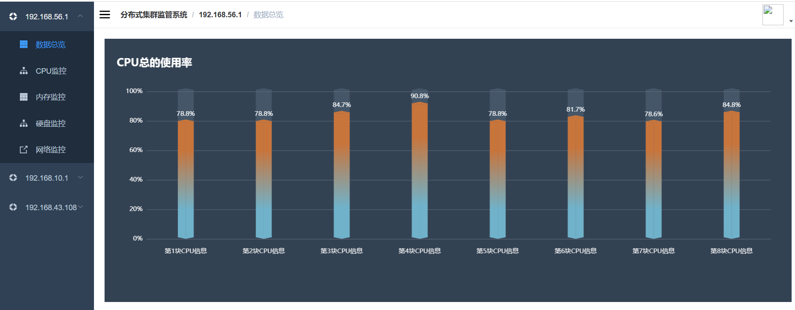

CPU实时数据界面

 

Cpu离线数据界面1

 

 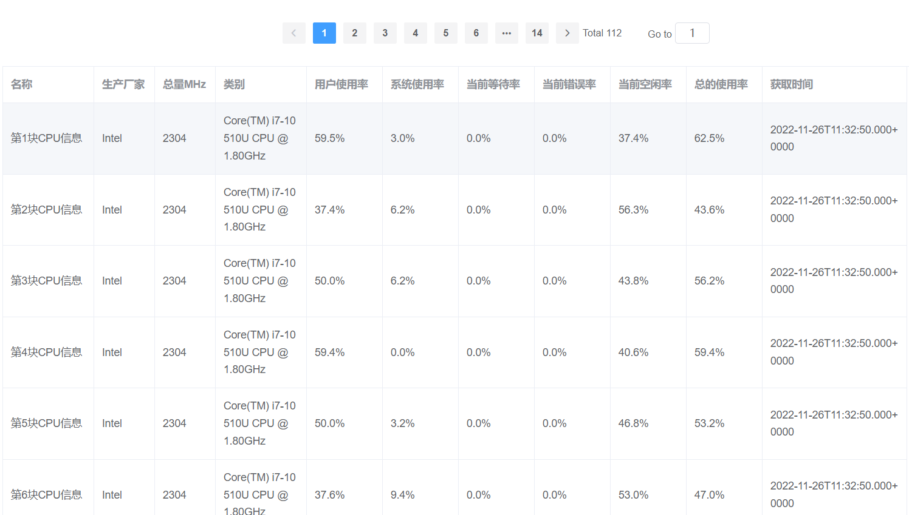

Cpu离线数据界面2

 

内存实时数据界面

 

 

内存离线数据界面

 

 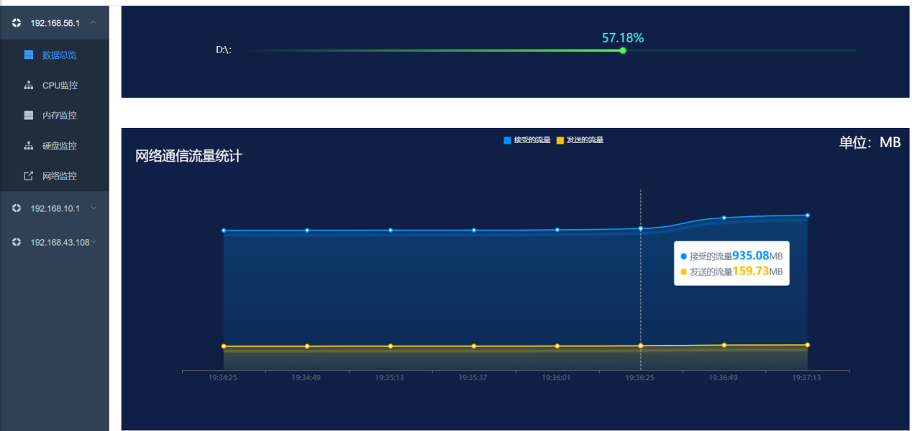

网卡实时数据界面

 

## 6.3 Netty的优势

当今的互联网环境下，分布式系统大行其道，而分布式系统的关键在于集群之间的通信，而Netty在开发高性能的服务器程序、高性能的客户端程序有着极大的优势。它能通过编程自定义各种协议，自己来编码/解码字节流，同时解决了TCP传输中的粘包、半包问题。Netty主要有以下几个特点。

### 6.3.1高并发

Netty是一款基于NIO（Nonblocking I/O，非阻塞IO）开发的网络通信框架，对比于BIO（Blocking I/O，阻塞IO），它的并发性能得到了很大提高，BIO和NIO的原理如下图：

 

BIO的通信方式

 

NIO的通信方式

从上面两图可以看出，NIO的单线程能处理连接的数量比BIO要高很多，产生这一差异的原因在于NIO中的Selector。

当一个连接建立之后，服务器端有两个步骤要做，第一步是接收完客户端发过来的全部数据，第二步是服务端处理完请求业务之后返回response给客户端。NIO和BIO的区别主要是在第一步。

在BIO中，等待客户端发数据这个过程是阻塞的，这样就造成了一个线程只能处理一个请求的情况，而机器能支持的最大线程数是有限的，这就是为什么BIO不能支持高并发的原因。而在NIO中，当一个Socket建立好之后，Thread并不会阻塞去接受这个Socket，而是将这个请求交给Selector，Selector会不断的去遍历所有的Socket，一旦有一个Socket建立完成，他会通知Thread，然后Thread处理完数据再返回给客户端，整个过程是不阻塞的，这样就能让一个Thread处理更多的请求，实现了高并发。

### 6.3.2传输快

相比其他网络框架，Netty的传输速度更快，这是依赖于NIO的一个特性——零拷贝。我们知道，Java的内存有堆内存、栈内存和字符串常量池等等，其中堆内存是占用内存空间最大的一块，也是Java对象存放的地方，一般我们的数据如果需要从I/O读取到堆内存，中间需要经过Socket缓冲区，也就是说一个数据会被拷贝两次才能到达它的终点，如果数据量大，就会造成不必要的资源浪费。传统的数据读取方式示意图如下：

 

传统的数据读取方式

Netty针对这种情况，使用了NIO中的另一大特性——零拷贝，当需要接收数据的时候，它会在堆内存之外开辟一块内存，数据就直接从I/O读到了那块内存中去，在Netty里面通过ByteBuf可以直接对这些数据进行直接操作，从而加快了传输速度。

 

NIO数据读取方式
